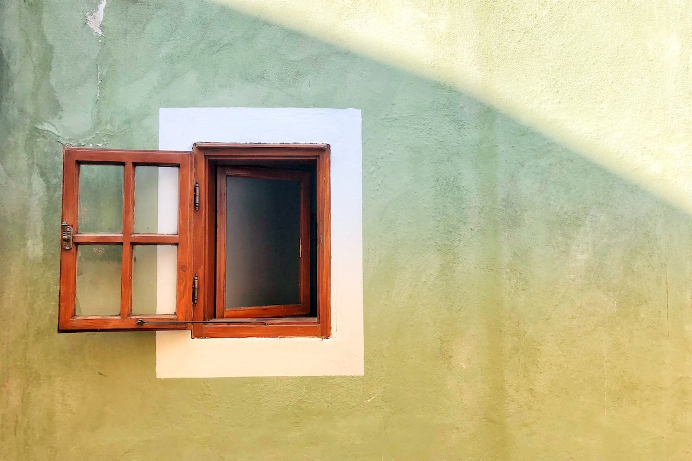

```{r setup, include=FALSE}
knitr::opts_chunk$set(echo = FALSE)
```

## A plug from your training reps

- Providing your input  
- [Training Events New channel](https://teams.microsoft.com/l/entity/c738b607-88dd-4f16-aefe-6a824c65d25d/_djb2_msteams_prefix_4030233446?context=%7B%22subEntityId%22%3Anull%2C%22channelId%22%3A%2219%3A99d084a21ad2464799302589fb1160e3%40thread.tacv2%22%7D&groupId=7ffde96d-6798-4228-92b2-884b3a972525&tenantId=c72728f7-4cca-49fe-bc49-47ab02f7a930&allowXTenantAccess=false)  
- What would you like to see?  
    
    - Essential vs Fun  
    - Please note down if you have a person in mind  
- We will review these at our Training reps catch ups

## Objective

- A step closeR
- starteR for ten
  
## Structure: Part I

- A showcase  
- R & RStudio environment  
- A chance to ask questions
  
## Structure: Part II

- Writing R Code  
- R lingo  
- Getting started   
- Using R    

## Part I


"Always mind your surroundings"

## A showcase

- Using R to collect data  
- Not just quantitative data  
- Data visualisation  
- Geo-spatial data  
- Streamlining the research process

## A showcase

  

## R and R Studio

- Script  
- Console  
- Environment  
- File

## Part II


"Be the spark that will light the fire"

## A framework for R

- Input  
- Process  
- Output  

## Language of R  

- Objects  
- Base R  
- Tidyverse  
- Functions  
- Packages  

## Getting started

- Creating a project  
- Keeping track of your projects  
- Organising your inputs, code, and output

## Resources

- Many roads lead to Rome  
- Depends on time, and interest  

## Resources

- Cover Week 1 of [John Hopkins Course](https://www.coursera.org/learn/r-programming#syllabus)  
- Read Part 1 of [Hands-On Programming with R](https://rstudio-education.github.io/hopr/index.html)  
- Start working in R + Make use of your network  

## Resources

- Advice from others